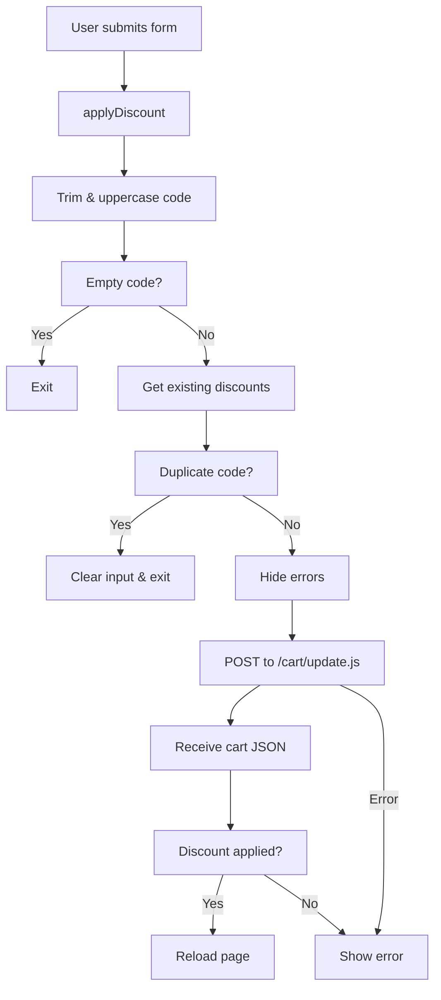

# cart-discount.js Documentation

This file defines two custom elements: **CartDiscount** and **DisclosureCustom**.

They enhance cart interactions by managing discount codes and accessible disclosure toggles.

## CartDiscount Component

The **CartDiscount** component handles discount code application and removal on the cart page.

It integrates with Shopify’s cart API and updates the UI accordingly.

### Class Definition & Registration

This section outlines how the component initializes and registers itself.

- Extends the native `HTMLElement` class.
- Initializes key properties and method bindings.
- Registers under the tag name `cart-discount-component`.

```js
if (!customElements.get('cart-discount-component')) {
  customElements.define('cart-discount-component', CartDiscount);
}
```

### Constructor

The constructor sets up initial state and binds methods.

- **Properties initialized**:
- `form`, `discountInput`, `cartDiscountError`, `cartDiscountErrorDiscountCode`, `cartDiscountErrorShipping`
- `boundApplyDiscount` (bound `applyDiscount`)
- `boundRemoveDiscount`  (bound `removeDiscount`)

### connectedCallback

This lifecycle method runs when the element enters the DOM.

- Locates DOM elements via `querySelector`.
- Logs an error if the form is missing.
- Attaches event listeners:
- **Submit** on the discount form.
- **Click** on the entire document for removal buttons.

### disconnectedCallback

This method cleans up event listeners on element removal.

- Removes the form’s **submit** listener.
- Removes the document’s **click** listener.

### Properties Overview

| Property | Type | Description |
| --- | --- | --- |
| `form` | `Element` | The discount form element. |
| `discountInput` | `HTMLInputElement` | The discount code input field. |
| `cartDiscountError` | `Element` | Container for displaying error messages. |
| `cartDiscountErrorDiscountCode` | `Element` | Error text for invalid discount codes. |
| `cartDiscountErrorShipping` | `Element` | Error text for shipping-related codes. |
| `boundApplyDiscount` | `Function` | Bound `applyDiscount` method. |
| `boundRemoveDiscount` | `Function` | Bound `removeDiscount` method. |


### applyDiscount 💳

This async method applies a discount on form submission.

- **Prevents** default form behavior.
- **Trims** and **uppercases** the entered code.
- **Checks** for empty or duplicate codes.
- **Hides** previous errors.
- Sends a **POST** to `/cart/update.js` with all discounts.
- **Reloads** the page on success, or **shows** an error on failure.

```js
async applyDiscount(event) {
  event.preventDefault();
  const code = this.discountInput?.value.trim().toUpperCase();
  if (!code) return;

  const existing = this.getExistingDiscounts();
  if (existing.some(c => c.toUpperCase() === code)) {
    this.discountInput.value = '';
    return;
  }

  this.hideErrors();
  const allDiscounts = [...existing, code].join(',');

  try {
    const response = await fetch(
      window.Shopify.routes.root + 'cart/update.js', {
        method: 'POST',
        headers: { 'Content-Type': 'application/json' },
        body: JSON.stringify({ discount: allDiscounts })
      }
    );
    const cart = await response.json();
    const applied = cart.cart_level_discount_applications
      ?.some(app => app.title?.toUpperCase() === code)
      || (cart.cart_level_discount_applications?.length > existing.length);

    if (applied) window.location.reload();
    else this.showError(code);
  } catch (error) {
    console.error('Error applying discount:', error);
    this.showError(code);
  }
}
```

#### Process Flowchart



### removeDiscount

This async method removes a single discount when its “×” button is clicked.

- **Detects** the clicked remove button.
- **Extracts** the discount code from the pill’s `data-discount-code`.
- **Prevents** default link behavior.
- **Fetches** `/cart/update.js` with an empty discount string.
- **Redirects** to apply remaining codes or **reloads** the page.

```js
async removeDiscount(event) {
  const removeBtn = event.target.closest('.cart-discount__pill-remove');
  if (!removeBtn) return;

  const pill = removeBtn.closest('.cart-discount__pill');
  const codeToRemove = pill?.dataset.discountCode;
  if (!codeToRemove) return;
  event.preventDefault();

  const existing = this.getExistingDiscounts();
  const remaining = existing.filter(c =>
    c.toUpperCase() !== codeToRemove.toUpperCase()
  );

  try {
    await fetch(window.Shopify.routes.root + 'cart/update.js', {
      method: 'POST',
      headers: { 'Content-Type': 'application/json' },
      body: JSON.stringify({ discount: '' })
    });

    if (remaining.length > 0) {
      const url = new URL(window.location.href);
      const returnUrl = encodeURIComponent(url.pathname + url.search);
      const path = remaining.map(encodeURIComponent).join(',');
      window.location.href = 
        `${window.Shopify.routes.root}discount/${path}?return_to=${returnUrl}`;
    } else {
      window.location.reload();
    }
  } catch (error) {
    console.error('Error removing discount:', error);
    window.location.reload();
  }
}
```

### hideErrors

This method hides all error message elements by adding the `hidden` class.

```js
hideErrors() {
  this.cartDiscountError?.classList.add('hidden');
  this.cartDiscountErrorDiscountCode?.classList.add('hidden');
  this.cartDiscountErrorShipping?.classList.add('hidden');
}
```

### showError

This method displays the appropriate error message based on the code content.

- Determines if the code relates to **shipping** (contains “ship” or “free”).
- Reveals either the shipping or discount-code error text.

```js
showError(code) {
  if (!this.cartDiscountError) return;
  const text = code.toLowerCase();
  const isShipping = text.includes('ship') || text.includes('free');
  this.cartDiscountError.classList.remove('hidden');
  const errorEl = isShipping
    ? this.cartDiscountErrorShipping
    : this.cartDiscountErrorDiscountCode;
  errorEl?.classList.remove('hidden');
}
```

### getExistingDiscounts

This utility returns an array of currently applied discount codes.

- Selects all `.cart-discount__pill` elements.
- Reads each pill’s `data-discount-code` attribute.

```js
getExistingDiscounts() {
  return Array.from(
    document.querySelectorAll('.cart-discount__pill')
  )
  .map(pill => pill.dataset.discountCode)
  .filter(Boolean);
}
```

### API Endpoints Documentation

```api
{
    "title": "Apply Discounts",
    "description": "Adds one or multiple discount codes to the cart.",
    "method": "POST",
    "baseUrl": "https://your-shop.myshopify.com",
    "endpoint": "/cart/update.js",
    "headers": [
        {
            "key": "Content-Type",
            "value": "application/json",
            "required": true
        }
    ],
    "queryParams": [],
    "pathParams": [],
    "bodyType": "json",
    "requestBody": "{\n  \"discount\": \"CODE1,CODE2\"\n}",
    "formData": [],
    "rawBody": "",
    "responses": {
        "200": {
            "description": "Cart updated successfully",
            "body": "{\n  \"cart_level_discount_applications\": [\n    { \"title\": \"CODE1\" },\n    { \"title\": \"CODE2\" }\n  ]\n}"
        },
        "400": {
            "description": "Invalid discount format",
            "body": "{\n  \"description\": \"Bad Request\"\n}"
        }
    }
}
```

```api
{
    "title": "Remove Discounts",
    "description": "Clears all discount codes from the cart.",
    "method": "POST",
    "baseUrl": "https://your-shop.myshopify.com",
    "endpoint": "/cart/update.js",
    "headers": [
        {
            "key": "Content-Type",
            "value": "application/json",
            "required": true
        }
    ],
    "queryParams": [],
    "pathParams": [],
    "bodyType": "json",
    "requestBody": "{\n  \"discount\": \"\"\n}",
    "formData": [],
    "rawBody": "",
    "responses": {
        "200": {
            "description": "Cart cleared of discounts",
            "body": "{\n  \"cart_level_discount_applications\": []\n}"
        }
    }
}
```

```card
{
    "title": "Duplicate Prevention",
    "content": "The component blocks reapplying the same code to avoid redundant requests."
}
```

---

## DisclosureCustom Component

The **DisclosureCustom** component creates accessible toggle sections.

It manages ARIA attributes and inert states for show/hide interactions.

### Class Definition & Registration

This section shows how the disclosure element sets up and registers itself.

- Extends `HTMLElement`.
- Looks for elements marked with `ref="disclosureTrigger"` and `ref="disclosureContent"`.
- Registers under the tag name `disclosure-custom`.

```js
if (!customElements.get('disclosure-custom')) {
  customElements.define('disclosure-custom', DisclosureCustom);
}
```

### Constructor

The constructor initializes reference properties.

- **Properties**:
- `trigger`: button or element that toggles visibility
- `content`: the collapsible content section

### connectedCallback

This lifecycle hook runs on element attachment.

- Queries for trigger and content elements.
- Logs an error if either is missing.
- Binds and attaches the `click` listener to the trigger.

### disconnectedCallback

This method removes the event listener on detach.

- Detaches the `click` event from the trigger.

### toggleDisclosure

This method toggles the disclosure state.

- Reads current `aria-expanded` on the trigger.
- Inverts `aria-expanded` value.
- Updates `aria-label` to match open/close text from `data-disclosure-open` and `data-disclosure-close`.
- Toggles the `inert` property on the content for accessibility.

```js
toggleDisclosure() {
  if (!this.trigger || !this.content) return;
  const expanded = this.trigger.matches('[aria-expanded="true"]');
  this.trigger.setAttribute('aria-expanded', String(!expanded));
  this.trigger.setAttribute(
    'aria-label',
    expanded ? this.trigger.dataset.disclosureOpen
             : this.trigger.dataset.disclosureClose
  );
  this.content.inert = expanded;
}
```