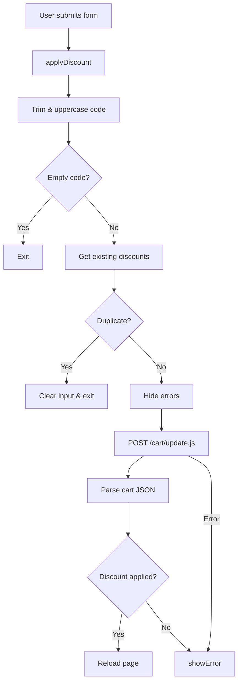

# cart-discount.js Components

`assets/cart-discount.js` exports **two** custom elements—`<cart-discount-component>` and `<disclosure-custom>`—to enhance cart discounts and accessible accordions.

**Source:** [`assets/cart-discount.js`](../../assets/cart-discount.js)

---

## What It Does

- **CartDiscount**: Applies, removes, and validates cart-level discount codes through Shopify’s `/cart/update.js` endpoint.
- **DisclosureCustom**: Powers accessible disclosures (accordion panels) used by the discount UX.

---

## CartDiscount API Overview

| Method / Property        | Purpose                                                                 |
|--------------------------|-------------------------------------------------------------------------|
| `constructor()`          | Caches DOM references, binds handlers, and prepares listeners.          |
| `connectedCallback()`    | Attaches submit/click handlers for applying or removing codes.          |
| `disconnectedCallback()` | Removes listeners when the component is detached.                       |
| `applyDiscount(event)`   | Submits a code to `/cart/update.js`, handling duplicates and errors.    |
| `removeDiscount(event)`  | Removes a pill’s code and reapplies remaining discounts if any.         |
| `hideErrors()`           | Adds `hidden` to every error target before a new attempt.               |
| `showError(code)`        | Displays shipping vs. generic errors based on the code contents.        |
| `getExistingDiscounts()` | Returns an array of the current pill `data-discount-code` values.       |

---

## CartDiscount Detailed Methods

### constructor()

- Initializes selectors (`form`, `discountInput`, error containers).
- Binds `applyDiscount` and `removeDiscount` to the component instance for reuse.

### connectedCallback()

- Validates the presence of the discount form and logs if it is missing.
- Adds `submit` on the form to call `applyDiscount`.
- Registers a delegated `click` listener on `document` for `.cart-discount__pill-remove`.

### disconnectedCallback()

- Removes the `submit` and delegated `click` listeners to avoid duplicates.

### applyDiscount(event) 💳

```js
async applyDiscount(event) {
  event.preventDefault();
  const code = this.discountInput?.value.trim().toUpperCase();
  if (!code) return;

  const existing = this.getExistingDiscounts();
  if (existing.some((c) => c.toUpperCase() === code)) {
    this.discountInput.value = '';
    return;
  }

  this.hideErrors();
  const allDiscounts = [...existing, code].join(',');

  try {
    const response = await fetch(`${window.Shopify.routes.root}cart/update.js`, {
      method: 'POST',
      headers: { 'Content-Type': 'application/json' },
      body: JSON.stringify({ discount: allDiscounts })
    });
    const cart = await response.json();
    const applied =
      cart.cart_level_discount_applications?.some(
        (app) => app.title?.toUpperCase() === code
      ) || cart.cart_level_discount_applications?.length > existing.length;

    if (applied) window.location.reload();
    else this.showError(code);
  } catch (error) {
    console.error('Error applying discount:', error);
    this.showError(code);
  }
}
```

- Normalizes user input (trim + uppercase) and prevents duplicates.
- POSTs to `/cart/update.js` with every active code to keep Shopify in sync.
- Reloads the page on success; otherwise exposes the correct error message.

#### Process Flowchart



### removeDiscount(event)

```js
async removeDiscount(event) {
  const removeBtn = event.target.closest('.cart-discount__pill-remove');
  if (!removeBtn) return;

  const pill = removeBtn.closest('.cart-discount__pill');
  const codeToRemove = pill?.dataset.discountCode;
  if (!codeToRemove) return;
  event.preventDefault();

  const existing = this.getExistingDiscounts();
  const remaining = existing.filter(
    (c) => c.toUpperCase() !== codeToRemove.toUpperCase()
  );

  try {
    await fetch(`${window.Shopify.routes.root}cart/update.js`, {
      method: 'POST',
      headers: { 'Content-Type': 'application/json' },
      body: JSON.stringify({ discount: '' })
    });

    if (remaining.length > 0) {
      const url = new URL(window.location.href);
      const returnUrl = encodeURIComponent(url.pathname + url.search);
      const path = remaining.map(encodeURIComponent).join(',');
      window.location.href = `${window.Shopify.routes.root}discount/${path}?return_to=${returnUrl}`;
    } else {
      window.location.reload();
    }
  } catch (error) {
    console.error('Error removing discount:', error);
    window.location.reload();
  }
}
```

- Removes the selected code and leverages Shopify’s `/discount/{codes}` redirect when multiple codes remain.
- Reloads the page if no codes are left.

### hideErrors()

```js
hideErrors() {
  this.cartDiscountError?.classList.add('hidden');
  this.cartDiscountErrorDiscountCode?.classList.add('hidden');
  this.cartDiscountErrorShipping?.classList.add('hidden');
}
```

- Ensures the UI resets before displaying a new error state.

### showError(code)

```js
showError(code) {
  if (!this.cartDiscountError) return;
  const text = code.toLowerCase();
  const isShipping = text.includes('ship') || text.includes('free');
  this.cartDiscountError.classList.remove('hidden');
  const errorEl = isShipping
    ? this.cartDiscountErrorShipping
    : this.cartDiscountErrorDiscountCode;
  errorEl?.classList.remove('hidden');
}
```

- Differentiates shipping promos (“ship”/“free”) from generic code issues so the correct text displays.

### getExistingDiscounts()

```js
getExistingDiscounts() {
  return Array.from(document.querySelectorAll('.cart-discount__pill'))
    .map((pill) => pill.dataset.discountCode)
    .filter(Boolean);
}
```

- Reads every pill’s `data-discount-code` attribute to keep the component stateless.

---

## Shopify API Reference

```api
{
  "title": "Apply Discounts",
  "method": "POST",
  "endpoint": "/cart/update.js",
  "body": "{ \"discount\": \"CODE1,CODE2\" }"
}
```

```api
{
  "title": "Remove Discounts",
  "method": "POST",
  "endpoint": "/cart/update.js",
  "body": "{ \"discount\": \"\" }"
}
```

> **Duplicate Prevention:** The component blocks reapplying the same code to avoid redundant requests.

---

## DisclosureCustom API Overview

| Method / Property        | Purpose                                                         |
|--------------------------|-----------------------------------------------------------------|
| `constructor()`          | Sets up `trigger` and `content` references.                     |
| `connectedCallback()`    | Queries DOM refs and binds `toggleDisclosure` to the trigger.   |
| `disconnectedCallback()` | Removes the trigger listener when detached.                     |
| `toggleDisclosure()`     | Toggles `aria-expanded`, updates labels, and sets `content.inert`. |

---

## DisclosureCustom Detailed Methods

### constructor()

- Initializes placeholder properties (`this.trigger`, `this.content`) for later hooks.

### connectedCallback()

- Selects the `[ref="disclosureTrigger"]` and `[ref="disclosureContent"]` children.
- Logs an error if either element is missing.
- Attaches the `click` listener to the trigger.

### disconnectedCallback()

- Removes the `click` listener to prevent memory leaks.

### toggleDisclosure()

```js
toggleDisclosure() {
  if (!this.trigger || !this.content) return;
  const expanded = this.trigger.matches('[aria-expanded="true"]');
  this.trigger.setAttribute('aria-expanded', String(!expanded));
  this.trigger.setAttribute(
    'aria-label',
    expanded ? this.trigger.dataset.disclosureOpen : this.trigger.dataset.disclosureClose
  );
  this.content.inert = expanded;
}
```

- Flips `aria-expanded`, swaps the `aria-label`, and relies on the `inert` attribute to block focus when collapsed.

---

## Custom Element Definitions

```js
if (!customElements.get('cart-discount-component')) {
  customElements.define('cart-discount-component', CartDiscount);
}

if (!customElements.get('disclosure-custom')) {
  customElements.define('disclosure-custom', DisclosureCustom);
}
```

Both elements are wrapped in guards so hot reloading or multiple bundles do not re-register them.

---

## Integration with Shopify Liquid

```liquid
<cart-discount-component>
  <form class="cart-discount-form">
    <input name="discount" placeholder="{{ 'cart.discount.code' | t }}">
    <button type="submit">{{ 'cart.discount.apply' | t }}</button>
    <p class="cart-discount__error hidden" data-error-type="code"></p>
    <p class="cart-discount__error hidden" data-error-type="shipping"></p>
  </form>

  <div class="cart-discount__pills">
    
      <span class="cart-discount__pill" data-discount-code="{{ code.title }}">
        {{ code.title }}
        <button class="cart-discount__pill-remove" type="button" aria-label="{{ 'accessibility.remove' | t }}">
          &times;
        </button>
      </span>
    
  </div>
</cart-discount-component>

<script src="{{ 'cart-discount.js' | asset_url }}" type="module"></script>
```

Use `<disclosure-custom>` to wrap expandable help text or FAQ content within the same form.

---

## Usage Checklist

1. Keep `.cart-discount__pill` and `.cart-discount__pill-remove` selectors intact.
2. Include both error containers (code + shipping) so `showError` can target them.
3. Load `cart-discount.js` on the cart page or wherever the discount UI appears.
4. Pair `<disclosure-custom>` elements with descriptive `data-disclosure-open` and `data-disclosure-close` labels for accessibility.
 
