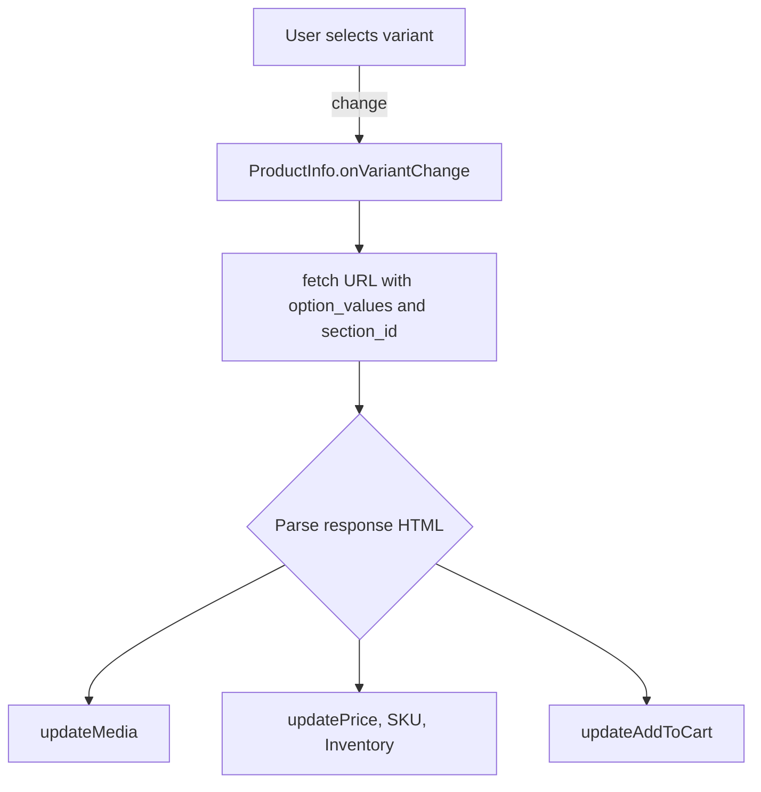

# sections/product.liquid 🛍️

The **`sections/product.liquid`** file defines Shopify’s Main Product section.  
It renders a customizable product page with media, pricing, and interactive blocks.  
This section leverages Storefront API, Liquid snippets, and JavaScript modules. 

## Purpose  
This section powers the product detail page.  
It displays product media, information, and purchasable options.  
Shopify merchants configure settings and blocks in the theme editor.

## Asset Includes  
External CSS and JS assets load dynamically based on settings and blocks:
```liquid
{{ 'swiper7.4.1.min.css' | asset_url | stylesheet_tag }}
{{ 'component-product-price.css' | asset_url | stylesheet_tag }}
{{ 'section-product.css' | asset_url | stylesheet_tag }}

  {{ 'component-product-media-modal.css' | asset_url | stylesheet_tag }}

…
<script src="{{ 'section-product.js' | asset_url }}" type="module"></script>
<script src="{{ 'swiper7.4.1.min.js' | asset_url }}" defer id="swiper-script"></script>
```
- **Swiper.js** powers media carousels.  
- **section-product.js** handles interactivity (variant changes, quantity). 

## Inline Styles  
A `<style>` block injects dynamic CSS per section settings:
```liquid

.section-{{ section.id }}-padding {
  padding-top: {{ section.settings.padding_top | times: 0.75 | round }}px;
  padding-bottom: {{ section.settings.padding_bottom | times: 0.75 | round }}px;
}
.option__label {
  color: {{ section.settings.variant_label_color }};
  font-size: {{ section.settings.variant_label_font_size }}px;
  font-weight: {{ section.settings.variant_label_font_weight }};
}
…  
@media screen and (min-width: 769px) { … }

```
Styles adapt typography, spacing, and responsive layout.

## Section Structure  
```liquid
<product-info
  data-url="{{ product.url }}"
  data-section="{{ section.id }}"
  class="color-{{ section.settings.color_scheme }} section-{{ section.id }}-padding"
>
  <div class="page-width">
    <div class="product flex product--{{ section.settings.media_size }} …">
      <!-- Media -->
      <div class="product__media-wrapper">
        
      </div>
      <!-- Info -->
      <div class="product__info-wrapper">
        
        
          
            <!-- Render each block -->
          
        
      </div>
    </div>
  </div>
</product-info>
```
- **`<product-info>`**: Custom element for JS interactivity.  
- **Media wrapper**: Renders gallery via snippet .  
- **Info wrapper**: Iterates blocks to display content.

## Block Types & Rendering  
| Block Type           | Purpose                                          |
|----------------------|--------------------------------------------------|
| **text**             | Rich text paragraph                              |
| **title**            | Product title heading                            |
| **price**            | Price display with badges  |
| **sku**              | Variant SKU                                      |
| **inventory**        | Stock status and low-stock warnings               |
| **variant_picker**   | Option selectors (dropdown or button swatches)   |
| **quantity_selector**| Quantity input with +/– controls                 |
| **description**      | Long product description                         |
| **buy_buttons**      | Add-to-cart and dynamic checkout                  |
| **share**            | Social share button                              |
| **subscription**     | Recurring purchase widget                        |
| **collapsible_tab**  | Accordion content                                |
| **complementary**    | Product recommendations                          |
| **custom_liquid**    | Admin-defined Liquid snippet                     |

## JavaScript Interactivity  
The `section-product.js` module binds to `<product-info>` events:
- **Variant changes**: Listens for `change` on `<variant-selector>`.  
- **Quantity events**: Handles plus/minus clicks and input validation.  
- **Section Rendering API**: Fetches updated HTML for new variants and swaps DOM fragments.  
- **URL & history**: Updates browser URL with selected variant.



## Schema Configuration  
### Section Settings  
Merchants customize global appearance and behavior:
- **enable_sticky_info**: Pin info sidebar  
- **color_scheme**: Theme palette  
- **media_size/position/layout**: Control gallery  
- **image_zoom**: Lightbox or hover zoom  
- **padding_top/bottom**: Vertical spacing  
- **variant_label_*:** Typography of option labels

### Block Settings  
Each block type exposes editor controls:
- **title**: Color, font size, weight  
- **price**: Typography, badge toggles  
- **inventory**: Threshold, show count  
- **variant_picker**: Picker style, swatch shape  

## Dependencies & Related Snippets  
- **component-product-media-gallery**: Renders Swiper gallery   
- **component-product-media-modal**: Lightbox modal  
- **component-product-media**: Renders images, videos, 3D models  
- **component-product-price**: Price logic and badges   
- **component-product-card** & **component-complementary-products**: Recommendation cards  
- **component-quick-add**, **component-modal-opener**: Quick-add UX  
- **component-pickup-availability**, **component-product-share-button**  

---

This documentation outlines the structure, purpose, and extensibility of the Main Product section. It highlights key snippets, interactive flows, and configuration options.