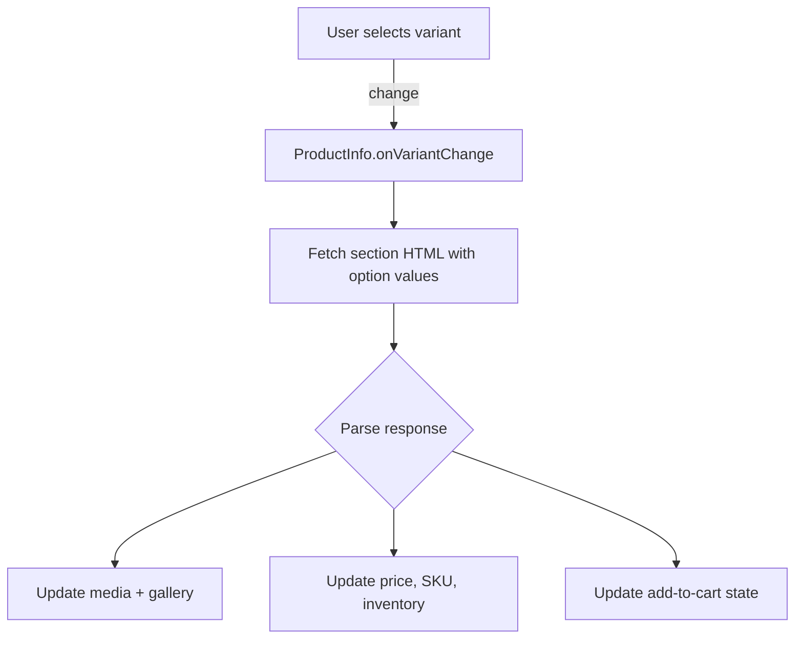

# Product Section (`sections/product.liquid`) 🛍️

`sections/product.liquid` renders Shopify’s main product detail page, combining media galleries, pricing, purchasing blocks, and dynamic scripts to keep variant selections in sync. Like the collection section, it leans on inline style blocks, shared snippets, and a custom element (`<product-info>`) to encapsulate state.

---

## Dynamic Styles

Each instance prints a scoped `<style>` block so merchants can fine-tune spacing and typography per section:

```liquid

.section-{{ section.id }}-padding {
  padding-top: {{ section.settings.padding_top | times: 0.75 | round }}px;
  padding-bottom: {{ section.settings.padding_bottom | times: 0.75 | round }}px;
}
.option__label {
  color: {{ section.settings.variant_label_color }};
  font-size: {{ section.settings.variant_label_font_size }}px;
  font-weight: {{ section.settings.variant_label_font_weight }};
}
@media screen and (min-width: 769px) {
  /* Desktop-specific tweaks */
}

```

Spacing, option typography, and layout tweaks all key off section settings so every product page can feel unique without editing theme code.

---

## Component Styles & Assets

The section registers CSS and JS assets based on configuration:

- **CSS**
  - `swiper7.4.1.min.css` (media carousel)
  - `component-product-price.css`
  - `section-product.css`
  - `component-product-media-modal.css` *(when `image_zoom` ≠ `none`)*
- **JavaScript**
  - `section-product.js` (variant + form logic)
  - `swiper7.4.1.min.js` (carousel, loaded with `defer`)
  - Optional quick-add or modal helpers depending on enabled blocks

This mirrors the pattern in `sections/collection.liquid`, ensuring all required assets load inline with the section.

---

## Markup Structure

```liquid
<product-info
  data-url="{{ product.url }}"
  data-section="{{ section.id }}"
  class="color-{{ section.settings.color_scheme }} section-{{ section.id }}-padding"
>
  <div class="page-width">
    <div class="product flex product--{{ section.settings.media_size }}">
      <div class="product__media-wrapper">
        
      </div>
      <div class="product__info-wrapper">
        
        
          
            <!-- Block-specific rendering -->
          
        
      </div>
    </div>
  </div>
</product-info>
```

### Media Column
- Powered by `component-product-media-gallery`, which in turn uses Swiper for carousels and optionally `component-product-media-modal` for zoom/lightbox experiences.
- Supports images, videos, 3D models, and AR assets.

### Info Column & Blocks
- Iterates through all blocks (`section.blocks`) to render pricing, options, share buttons, etc.
- `product_form_id` ties `<product-form>` instances to the JS controller.

---

## Block Types & Rendering

| Block Type            | Purpose                                             |
|-----------------------|-----------------------------------------------------|
| `title`               | Renders the product title heading                   |
| `text`                | Rich text content (marketing copy, notices)         |
| `price`               | Uses `component-product-price` for badges + compare |
| `sku` / `inventory`   | Displays SKU and stock messaging                    |
| `variant_picker`      | Dropdowns or swatches for option selection          |
| `quantity_selector`   | Quantity input with +/- controls                    |
| `buy_buttons`         | Add to cart, dynamic checkout, Shop Pay, etc.       |
| `description`         | Full product description content                    |
| `share`               | Social sharing via `component-product-share-button` |
| `subscription`        | Subscription selling plans                          |
| `collapsible_tab`     | Accordion content for specs or FAQs                 |
| `complementary`       | Recommendations using `component-complementary-products` |
| `custom_liquid`       | Merchant-defined Liquid/HTML                        |

---

## JavaScript Behavior

`section-product.js` targets the `<product-info>` element to manage everything from variant selection to cart state:

- **Variant Changes**: Watches `<variant-selector>` change events, fetches updated HTML via the Section Rendering API, and swaps media, price, SKU, and inventory fragments.
- **Quantity Controls**: Handles increment/decrement buttons and validation.
- **URL Sync**: Pushes the active variant ID into the query string so share links reflect the selected option.



---

## Settings Schema

### Section Settings

| Setting ID               | Type        | Purpose                                                   |
|-------------------------|-------------|-----------------------------------------------------------|
| `enable_sticky_info`    | checkbox    | Locks the info column on desktop                          |
| `color_scheme`          | color       | Applies theme palette classes                             |
| `media_size`/`position` | select      | Controls gallery width and placement                      |
| `image_zoom`            | select      | Enables modal or hover zoom behaviors                     |
| `padding_top/bottom`    | range (px)  | Section spacing controls                                  |
| `variant_label_*`       | color/range | Typography for option labels                              |

### Block Settings

- `title`: Size, weight, color controls.
- `price`: Toggles badges (sale, sold out), compare-at styling.
- `inventory`: Thresholds for low-stock messaging.
- `variant_picker`: Picker style (dropdown, pills) and swatch settings.
- `buy_buttons`: Enable dynamic checkout, Shop Pay, or quick buy.

---

## Related Snippets & Assets

- `component-product-media-gallery`, `component-product-media`, `component-product-media-modal`
- `component-product-price`, `component-product-card`
- `component-quick-add`, `component-modal-opener`, `component-pickup-availability`
- `component-product-share-button`, `component-complementary-products`

---

## Implementation Notes

1. Always wrap the section markup in `<product-info>` so the JS controller can hook into it.
2. Ensure Swiper assets load only once by guarding them in the section or layout.
3. When adding new blocks, keep selectors consistent so `section-product.js` can update them via Section Rendering responses.
4. Align padding and color settings with the global theme options to maintain consistency across templates.

